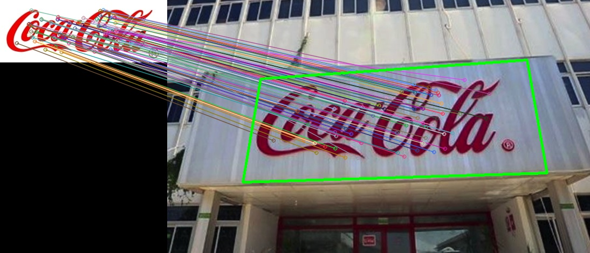

# Linux 安裝 OpenCV
Linux 查詢 OpenCV 版本:

```sh
opencv_version
```
> 3.4.4


#### 1. get opencv_contrib
```
git clone https://github.com/opencv/opencv_contrib.git
cd opencv_contrib
git checkout 4.1.0
cd ..
```

#### 2. lets create a build directory inside opencv folder and install opencv where we will refer opencv_contrib
```
wget https://github.com/opencv/opencv/archive/4.5.2.zip
unzip 4.5.2.zip
cd opencv-4.5.2/
mkdir build
cd build
cmake -D CMAKE_BUILD_TYPE=RELEASE -D OPENCV_ENABLE_NONFREE=ON -D OPENCV_EXTRA_MODULES_PATH=../../opencv_contrib/modules -D WITH_GTK=ON -D CMAKE_INSTALL_PREFIX=/usr/local ..
make
sudo make install
ldconfig
```

## Reference
- [Ubuntu 18.04 安裝 OpenCV 與建置 C++ 編譯環境](https://wenyuangg.github.io/posts/opencv/opencv-installation.html)


## Feature Detection 特徵提取
在 OpenCV 中提供下面三種演算法可以對一張影像進行特徵點的萃取。在進行特徵點萃取前必須將影像轉為灰階影像，因為色彩易受光照影響，因此難以提供關鍵訊息故將影像進行灰階化，同時也可以加快特徵提取的速度。另外要辨識物體，最關鍵的因素是梯度也就是邊緣物體位置。自然就用到灰度影像，因此可以把灰階理解為影像的強度。

<table>
    <tbody>
        <tr>
            <td>SURF</td>
            <td>SIFT</td>
            <td>ORB</td>
        </tr>
        <tr>
            <td>
                
            </td>
            <td>
               
            </td>
            <td>
                
            </td>
        </tr>
        <tr>
            <td>901 個關鍵點</td>
            <td>547 個關鍵點</td>
            <td>492 個關鍵點</td>
        </tr>
    </tbody>
</table>

```c
#include <opencv2/opencv.hpp>
#include <opencv2/xfeatures2d.hpp>
#include <iostream>
using namespace cv;
using namespace cv::xfeatures2d;
using namespace std;

int main()
{
    Mat srcImage = imread("./images/target.jpg", 0);

//     int numFeatures = 20; // 可以指定擷取特徵數量 create(numFeatures)
//     Ptr<SIFT> dectector = SIFT::create();
    Ptr<SURF> dectector = SURF::create();
//     Ptr<ORB> dectector = ORB::create();

    vector<KeyPoint> keypoints;
    dectector->detect(srcImage, keypoints, Mat());
    printf("Total keypoints: %ld\n", keypoints.size());

    Mat keypoint_img;
    drawKeypoints(srcImage, keypoints, keypoint_img, Scalar::all(-1), DrawMatchesFlags::DEFAULT);
    cv::imwrite("result.jpg", keypoint_img);
}
```
 
> 程式碼參考[Feature_Detection.cpp](./Feature_Detection.cpp)

- [tutorial_feature_detection](https://docs.opencv.org/4.5.2/d7/d66/tutorial_feature_detection.html)
- [sift、surf、orb 特徵提取及最優特徵點匹配](https://blog.csdn.net/Bruce_0712/article/details/115067629)

## 使用 Features2D + Homography 尋找物件
參考 [Features2D_Homography.cpp](./Features2D_Homography.cpp)，透過 SURF 演算法尋找照片中的特徵點，接著關鍵點配對透過 knnMatch 尋找距離最近的相似點。最後計算 Homography，可以找出目標影像中欲辨識物體的位置並且將它框起來。

<table>
    <tbody>
        <tr>
            <td>
                
            </td>
            <td>
               
            </td>
            <td>
                
            </td>
        </tr>
    </tbody>
</table>


- [Features2D + Homography to find a known object](https://docs.opencv.org/4.5.2/d7/dff/tutorial_feature_homography.html)
- [【OpenCV】OpenCV 4 下 SIFT、SURF的使用](https://blog.csdn.net/Gordon_Wei/article/details/88920411)
- [SIFT特徵和SURF特徵比較](https://www.yisu.com/zixun/588386.html)


## 如何編譯程式
### 方法一使用 Cmake
參考以下指令透過 Cmake 建構專案。`CMakeLists.txt` 待編譯的檔案為 `Features2D_Homography.cpp`(第三行)。

```
mkdir build
cd build
sudo cmake -D CMAKE_INSTALL_PREFIX=/home/jovyan/project/cpp_opencv/ ..
sudo make install
sudo make
./main
```

### 方法二透過 g++ 編譯
編譯 `Feature_Detection.cpp`：
```
g++ -o main Feature_Detection.cpp -I /usr/local/include/opencv4/ -L /usr/local/lib  -lopencv_features2d  -lopencv_imgcodecs -lopencv_core
./main
```

編譯 `Features2D_Homography.cpp`：
```
g++ -o main Features2D_Homography.cpp -I /usr/local/include/opencv4/ -L /usr/local/lib  -lopencv_features2d -lopencv_xfeatures2d -lopencv_calib3d -lopencv_imgcodecs -lopencv_imgproc -lopencv_core
./main
```

編譯 `Features2D_Homography_SIFT.cpp`：
```
g++ -o main Features2D_Homography_SIFT.cpp -I /usr/local/include/opencv4/ -L /usr/local/lib  -lopencv_features2d -lopencv_xfeatures2d -lopencv_calib3d -lopencv_imgcodecs -lopencv_imgproc -lopencv_core
./main
```


# Linux 編譯 OpenCV
## 使用指令編譯程式

```
g++ -o main main.cpp -I /usr/local/include/opencv4/ -L /usr/local/lib  -lopencv_features2d  -lopencv_imgcodecs -lopencv_core
```


## 建立 pkg-config
我們可以透過建立 `pkg-config` 文件來幫我們管理每個套件的路徑（標頭文件路徑/include，庫文件路徑/lib）。透過 `pkg-config` 提供的參數(–cflags, –libs)，將所需信息提取出來供編譯和連接使用。因此可以省去在終端機用 g++ 編譯時後面添加的 `-I`、`-L`、`-l` 這些 flag。

```
cd /usr/local/lib
sudo mkdir pkgconfig && cd pkgconfig
sudo vim opencv.pc
```

```
prefix=/usr/local/
exec_prefix=${prefix}
includedir=${exec_prefix}/include/opencv4
libdir=${exec_prefix}/lib

Name: OpenCV
Description: Open Source Computer Vision Library
Version: 4.5.2
Libs: -L${libdir} -lopencv_stitching -lopencv_superres -lopencv_videostab -lopencv_aruco -lopencv_bgsegm -lopencv_bioinspired -lopencv_ccalib -lopencv_dnn_objdetect -lopencv_dpm -lopencv_face -lopencv_photo -lopencv_freetype -lopencv_fuzzy -lopencv_hdf -lopencv_hfs -lopencv_img_hash -lopencv_line_descriptor -lopencv_optflow -lopencv_reg -lopencv_rgbd -lopencv_saliency -lopencv_stereo -lopencv_structured_light -lopencv_phase_unwrapping -lopencv_surface_matching -lopencv_tracking -lopencv_datasets -lopencv_text -lopencv_dnn -lopencv_plot -lopencv_xfeatures2d -lopencv_shape -lopencv_video -lopencv_ml -lopencv_ximgproc -lopencv_calib3d -lopencv_features2d -lopencv_highgui -lopencv_videoio -lopencv_flann -lopencv_xobjdetect -lopencv_imgcodecs -lopencv_objdetect -lopencv_xphoto -lopencv_imgproc -lopencv_core
Libs.private: -ldl -lm -lpthread -lrt
Cflags: -I${includedir}
```

> 不確定要不要：
```
export PKG_CONFIG_PATH=/usr/local/pkgconfig:$PKG_CONFIG_PATH
sudo ldconfig
```

### 透過 pkg-config 查看 OpenCV 版本

```
pkg-config --modversion opencv
```

### 使用 pkg-config 指令編譯程式

```
g++ -o main main.cpp `pkg-config --cflags --libs opencv`
```

```
g++ -o main Features2D_Homography.cpp `pkg-config --cflags --libs opencv`
```

## Reference
- [OpenCV 自定義環境變量pkg-config](https://www.cnblogs.com/dinghongkai/p/11287688.html)
- [compiling opencv in c++](https://stackoverflow.com/questions/9094941/compiling-opencv-in-c)